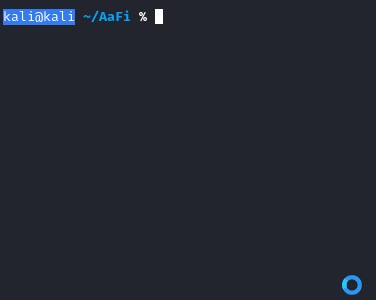

# Installing AaFi

## Installing AaFi

For a more in depth installation please check out the [Wiki](https://docs.aafi.xyz)

## Installing Wordlist for Cracking Module

Wordlists for Cracking: [Wordlists](https://www.mediafire.com/folder/e8ltrg1zo3oy9/Wordlists)

### Installing Dependencies

To install the required dependencies simply manually install them from here or use the automatic install script `./install.sh` that is included with the install package of AaFi.

| Dependency | Command |
| :--- | :--- |
| Updating Repos and Updating Operating System | `sudo apt-get upgrade && sudo apt-get update` |
| hostapd-wpe | `sudo apt-get install hostapd-wpe -y` |
| mdk3 | `sudo apt-get install mdk3 -y` |
| aircrack-ng | `sudo apt-get install aircrack-ng -y` |
| network-manager | `sudo apt-get install network-manager -y` |
| macchanger | `sudo apt-get install macchanger -y` |

### Chmod AaFi Shell Script

After installing AaFi from the Github Repository go to the AaFi folder found in the destination you saved the folder. then `cd AaFi` to go to the AaFi folder. After that `chmod +x` the script to make it executable.

### Disclaimer:

AaFi was created and is used to educate others please do not use this tool for malicious purposes. Usage of all tools on the repos for attacking targets without prior mutual consent is illegal. It is the end users responsibility to obey the law.

