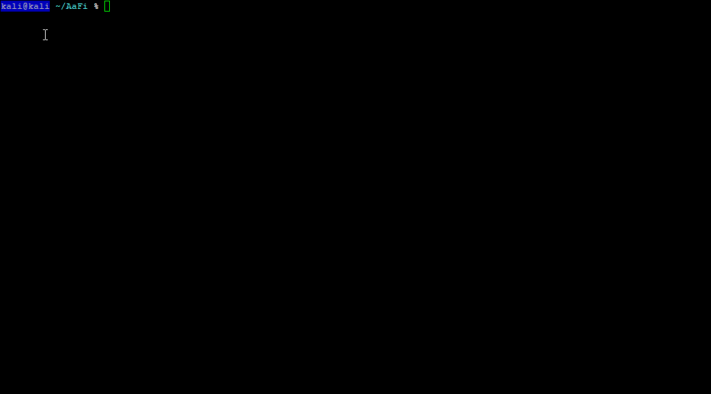

# Deauth

## Starting the Deauth Module:

To start the Deauth Module run the command `sudo ./AaFi.sh`

From there you should be greeted with the AaFi Menu Select which deauth attack you wish to choose to execute. 

## Types of Deauth Attacks Available:

* Deauth a Specific SSID 
* Deauth all channels 
* Deauth a Specific Device on AP 

## Entering the BSSID: 

Upon running the module it will ask you for a BSSID you should be able to find the BSSID listed at the top as shown here. Then enter the BSSID to contine the attack process. 

