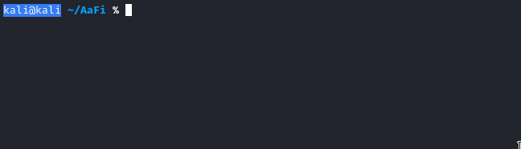

# Rouge/Fake AP

## Setting Up Rouge/Fake AP Module:

Just place all files in /var/www/html/, run the command chown `www-data:www-data ./*` \(may want to limit it to the html, js, passwords.txt and images if running on a large network\) and run: \`\` `sudo ./AaFi.sh wlan1 eth0 [FAKE NETWORK NAME]` then AaFi's fake AP module should work perfectly.

Note: when selecting a Interface Type in the command please select the correct one so the module will work perfectly.

## Usage:

The user **must** start the command with `sudo ./AaFi [Network Interface] [Fake Network Name]` in order to run the command successfully.

## Interface Types:

* `eth0`
* `lo`
* `wlan0`
* `wlan1`

## Which Interface Should I Use?

If you do not know which wireless interface to use initially then running the command `ifconfig` should pull up the interfaces that you have available.

However, if you are still confused running the command `sudo airmon-ng` should bring up the best possible interfaces to use when running this command.

