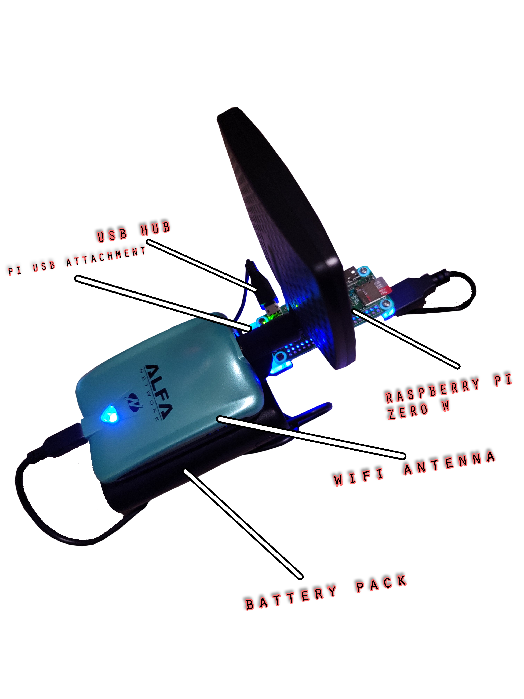

# Design Progress

## Materials Needed:

* Raspberry Pi Zero W
* 32 GB Micro SD Card
* Alfa AWUS036NH
* Battery Pack

## \[V1 Design\] Orginal Prototype Design of AaFi. 

Found that USB extension for Raspberry Pi Zero did not work at all. Design was later scraped early on in development. 

## \[V2 Design Top\] Design of AaFi 

Later design of AaFi that ended up being the final design for AaFi.

## \[V2 Design Side\] Design of AaFi 

Side View of the finalized design 

