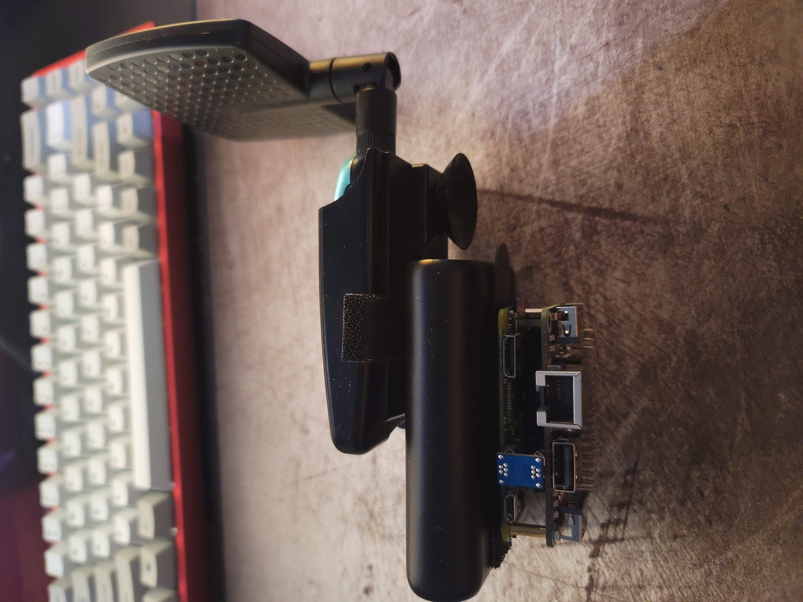

# Design Progress

## Materials Needed for AaFi:

* Raspberry Pi Zero W
* 32 GB Micro SD Card
* Ethernet/USB HUB HAT Expansion Board for Raspberry Pi 4B/3B+/3B/2B/Zero/Zero W/Zero WH,with RJ45 10/100M Ethernet Port
* Alfa AWUS036NH
* Battery Pack

## \[V1 Design\] Orginal Prototype Design of AaFi. 

Found that USB extension for Raspberry Pi Zero did not work at all. Design was later scrapped early on in development. 

## \[V2 Design Top\] Design of AaFi 

## \[V2 Design Side\] Design of AaFi 

## Final Design of AaFi Side View

Essentially the same design as V2 but added a ethernet hat on to the Raspberry Pi Zero W for ethernet connenctivity. 

