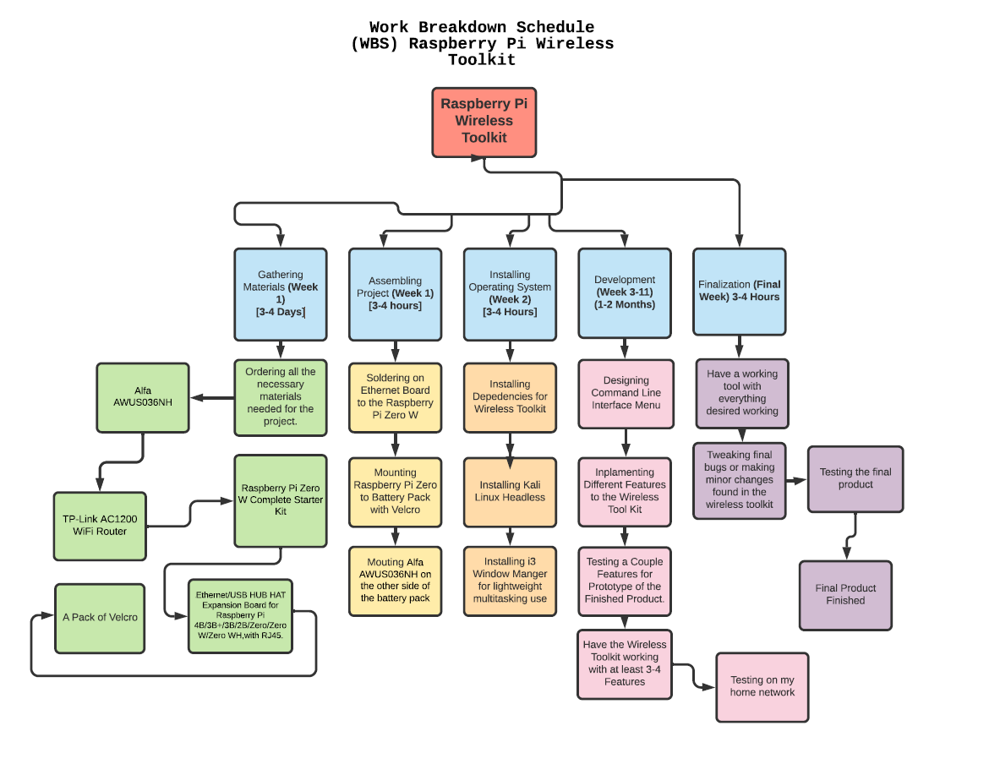

# Phases / Milestones on AaFi

## Work Breakdown Schedule for AaFi

## The Plan for AaFi

The plan for developing AaFi was to try to make the user interface as simple as possible first off. At the same time trying to develop at least 3 features to keep the whole project stable as possible. After that I tried to follow everything that I had planned out in the work breakdown schedule. My final plan was to have something that was easy to use for everyone and make this toolkit as user friendly as possible. 

